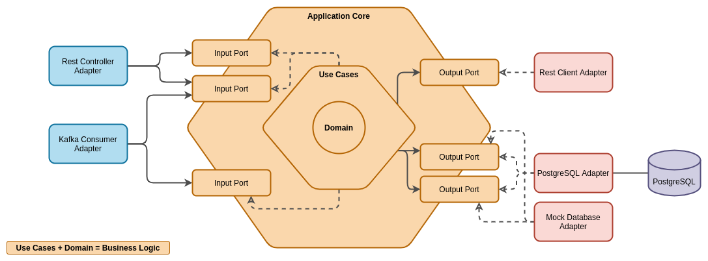

# ms-security-practica
Semilla de java con en springboot 2.6.7 para la generación de microservicios en arquitectura hexagonal 


###Properties
Esta semilla esta preparada para que las properties o configuraciones las tome de un [cloud config](https://gitlab.com/arquitectura-prisma/issuing/3dsecure/projects/config-server) (Si no conoces aca esta el [link de spring cloud](https://cloud.spring.io/spring-cloud-config/reference/html/))

La configuracion del cloud config se encuentra en el boostrap.yml

###Configuration Properties
Para la carga de configuraciones, y para evitar el uso del @value de spring y de esta manera centralizar las properties se utilizan clases para el mapeo de las properties mediante una configuracion llamada @ConfigurationProperties(prefix = "")
De esta manera podemos tener las properties mapeadas en un objeto que puede injectarse en cualquier componente y ser utilizado para leer alguna propertie en particular
para ver como funciona [aca](https://www.baeldung.com/configuration-properties-in-spring-boot) hay una guia de implementacion
En esta semilla existe una clase SpringConfigurationProperties donde se configuran las properties del spring 

## Estructura
Para este proyecto se esta usando una interpretacion de la arquitectura Hexagonal, tambien conocida como Ports and Adapters. El enfoque que decidimos tomar es bastante similar a lo que se plantea en [este articulo](https://reflectoring.io/spring-hexagonal/)

### Concepto


### Ejemplo



### Ejemplo Semilla


## Packages
```text
springkotlinseed
├── adapter: Aquí se especifican los distintos adapters de la aplicación
│   └── <adapter_name>
│       ├── exception: Aqui van las excepciones que el adapter puede interpretar
│       └── model: Aqui van las clases que representan request/responses del adapter.
├── application
│   ├── port
│   │   ├── in: Aqui van las interfaces que representan puertos de entrada a los casos de uso
│   │   └── out: Aqui van las interfaces que representan puertos de salida de los casos de uso
│   └── usecase: Aqui van las clases que representan los casos de uso
├── config
│   ├── exception: Aqui van las excepciones de dominio del servicio
│   ├── properties: Aqui van las clases que representan propiedades del servicio
├── domain: Aqui van los dominios de tu servicio
└── extensions: Aqui van los utils que creas necesario para tu código
```

